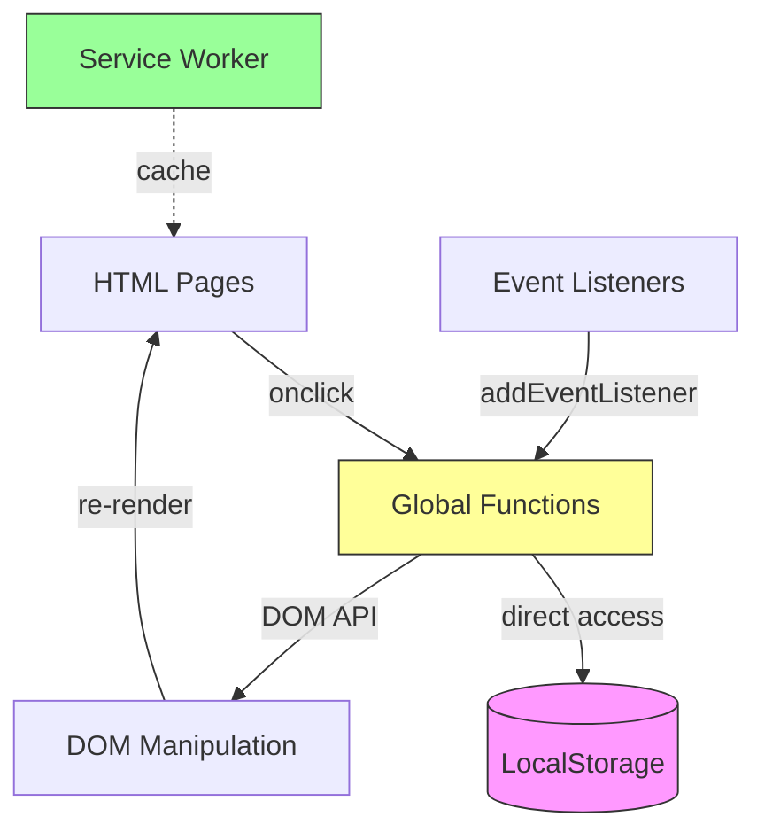
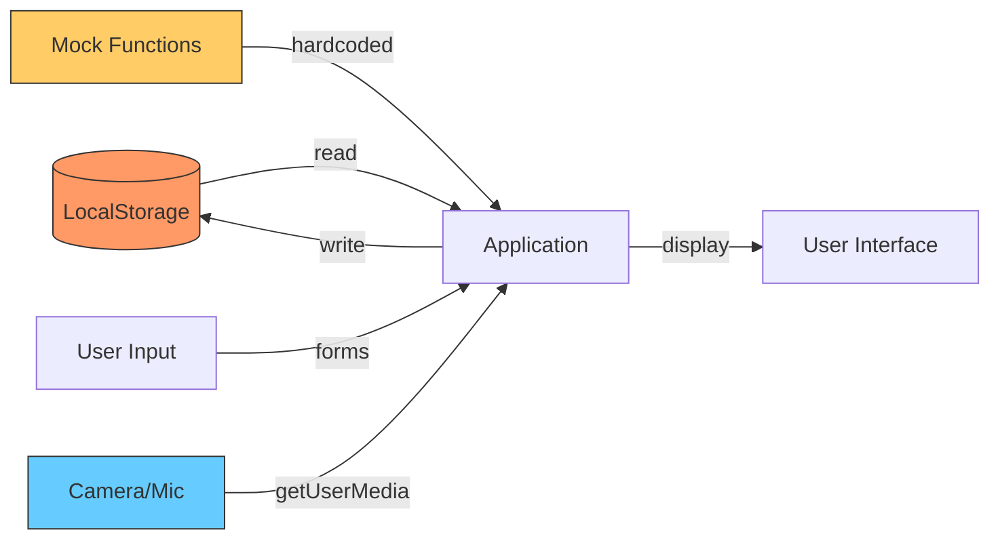
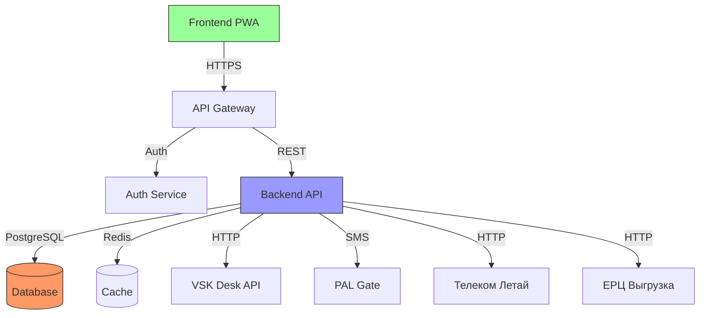
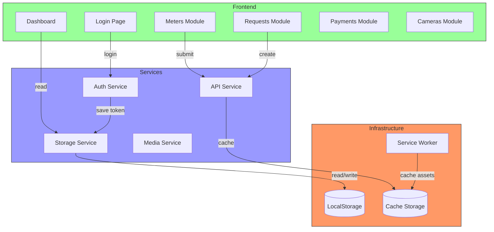
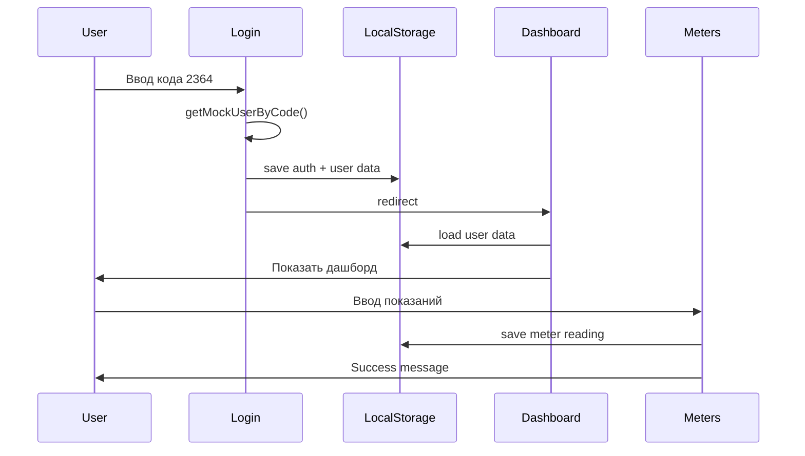
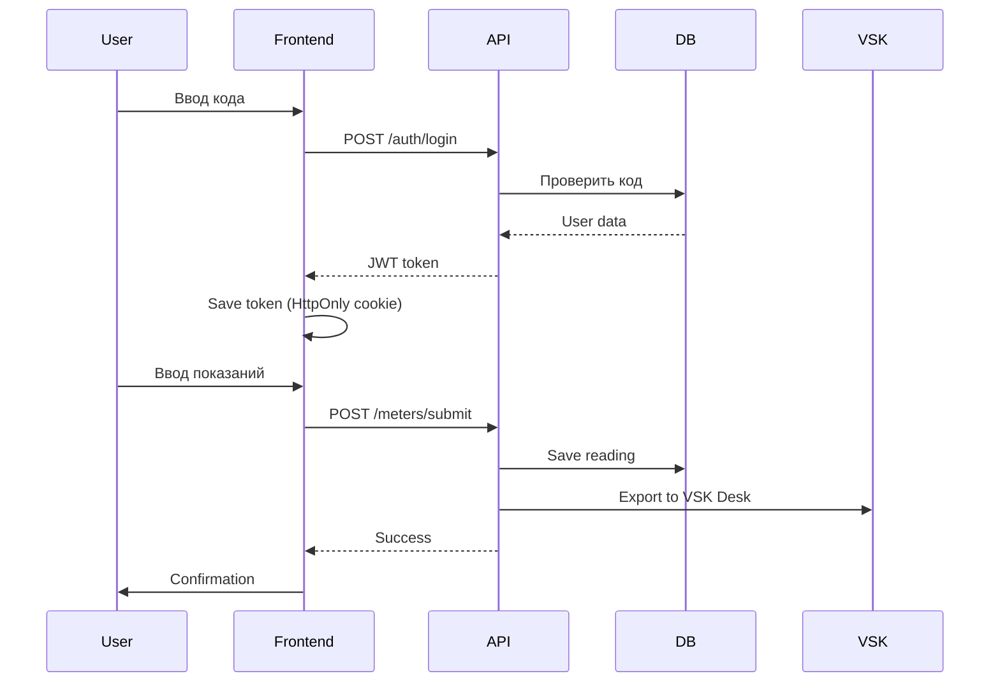
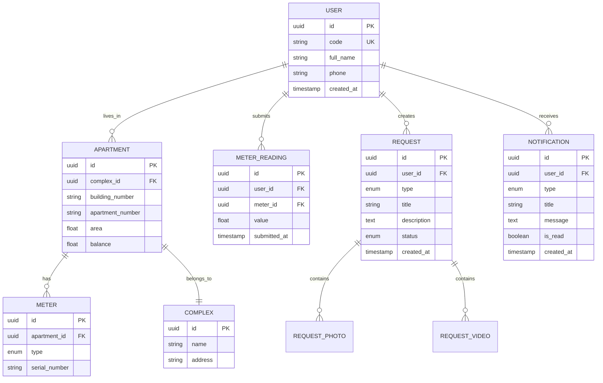
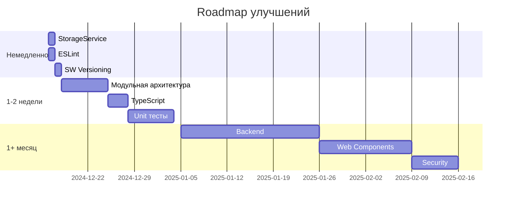

# Архитектурный анализ проекта УК «Зелёная долина»

**Дата анализа:** December 2024  
**Версия приложения:** v7.2.4  
**Размер проекта:** 53 файла, ~4.15 MB

---

## 1. ОБЩИЙ ОБЗОР

### Тип приложения
**Progressive Web Application (PWA)** с возможностью работы в offline-режиме

### Основной стек
- **Тип:** Multi-Page Application (MPA) + PWA
- **Язык:** Vanilla JavaScript (ES6+), TypeScript (частично в `/src`)
- **Платформа:** Web (адаптивная версия для mobile, tablet, desktop)
- **Hosting:** GitHub Pages (`pustem754-hash.github.io/zelenaya-dolina`)

### Целевая платформа
- **Primary:** Мобильные браузеры (iOS Safari, Chrome Android)
- **Secondary:** Desktop браузеры
- **Требования:** Современные браузеры с поддержкой ES6+, Service Worker, LocalStorage

### Назначение
Цифровая платформа для управления жилым комплексом с интеграцией:
- Передача показаний счётчиков
- Создание заявок в VSK Desk
- Управление шлагбаумом PAL Gate (SMS)
- Просмотр камер Телеком Летай
- Платежи и квитанции

---

## 2. ТЕХНОЛОГИЧЕСКИЙ СТЕК

### Frontend

#### UI библиотека/фреймворк
- **Vanilla JavaScript** (без фреймворков)
- **Material Design 3** принципы (CSS)
- Встроенная система компонентов

**Файлы:**
- `public/css/buttons.css` - библиотека кнопок MD3
- `public/css/modern-index.css` - глобальные стили MD3
- `public/css/components.css` - переиспользуемые компоненты

#### State Management
- **LocalStorage** для персистентного состояния
- Глобальные переменные для runtime состояния
- Нет централизованного state manager

**Ключи localStorage:**
```javascript
- 'zd_isAuthenticated' - статус авторизации
- 'zd_login_code' - код доступа
- 'zd_user_data' - данные пользователя
- 'userData' - legacy ключ
- 'userPhone' - legacy ключ
- Показания счётчиков, фото, видео, аудио
```

**Проблема:** 99 обращений к localStorage в `index.html` - нет абстракции

#### Стилизация
```
public/css/
  ├── buttons.css (542 lines)      # Система кнопок MD3
  ├── modern-index.css (614 lines) # Главные стили
  ├── components.css               # Компоненты
  ├── mobile.css                   # Мобильная адаптация
  ├── responsive.css               # Responsive breakpoints
  ├── animations.css               # Анимации
  ├── navigation.css               # Навигация
  └── brand.css                    # Брендинг
```

**Подход:** CSS Variables + классы, без препроцессоров

#### Роутинг
- **Отсутствует** традиционный роутинг
- **Multi-Page:** каждая страница = отдельный HTML файл
- **SPA-like навигация** внутри `index.html` через `showSection(id)`

**Страницы:**
```
/login.html          # Вход по 4-значному коду
/index.html          # Главная (дашборд)
/payments.html       # Платежи
/meters.html         # Счётчики
/cameras.html        # Камеры
/barrier.html        # Шлагбаум
/create-request.html # Создание заявки
```

---

### Backend (отсутствует)

**Статус:** Чистый frontend без серверного бэкенда

**Mock данные:**
- Захардкоженные пользователи в `getMockUserByCode()` 
- Тестовые данные счётчиков, заявок, уведомлений
- Нет реальных API вызовов (пока)

**Планируемые интеграции (из типов):**
```typescript
// src/types/api.ts
- VSK Desk API - заявки
- PAL Gate API - шлагбаум через SMS
- Телеком Летай - камеры
- ЕРЦ - выгрузка показаний
- Платежная система
```

**База данных:** Отсутствует (LocalStorage как псевдо-БД)

**Аутентификация:**
- Кастомная система по 4-значному коду
- Данные в localStorage (НЕ безопасно для продакшена)
- Нет JWT, OAuth, session tokens

**API стиль:** 
- Планируется REST (из типов TypeScript)
- Пока только mock функции

---

### Инструменты

#### Сборщик
**Отсутствует** - нативный ES6 modules

**Проблемы:**
- Нет минификации
- Нет tree-shaking
- Нет bundling
- Каждый файл - отдельный HTTP запрос

#### Тестирование
```json
// package.json
"devDependencies": {
  "jest": "^30.2.0"
}
```

**Файлы тестов:**
```
/simple.test.js
/test-simple.js
/test-runner.js
/index.test.js
```

**Статус:** Настроено, но **не используется активно**

#### Линтинг/форматирование
**Отсутствует**
- Нет ESLint
- Нет Prettier
- Нет pre-commit hooks

#### CI/CD
**GitHub Pages** с автоматическим деплоем

```bash
# deploy.bat / deploy.ps1
git add .
git commit -m "..."
git push origin main
```

**Проблемы:**
- Ручной деплой
- Нет автоматических тестов перед деплоем
- Нет version bumping

**PWA управление:**
```javascript
// public/sw.js
const CACHE_NAME = 'zelenaya-dolina-v7.2.3-final-fix';
```

**Проблема:** Версия Service Worker не обновляется автоматически

---

## 3. СТРУКТУРА ПРОЕКТА

### Организация папок

```
zelenaya-dolina/
├── public/                    # Статические файлы (деплоится)
│   ├── css/                   # 11 CSS файлов (~1500 lines)
│   ├── js/                    # 7 JS модулей (~1000 lines)
│   ├── *.html                 # 9 HTML страниц
│   ├── manifest.json          # PWA манифест
│   ├── sw.js                  # Service Worker
│   └── icons/                 # 14 иконок разных размеров
│
├── src/                       # TypeScript типы (НЕ используются)
│   ├── api/mainScreen.ts
│   ├── screens/MainScreen.tsx
│   ├── store/mainScreenStore.ts
│   └── types/api.ts           # Определения типов API
│
├── scripts/                   # Node.js утилиты
│   ├── generate-residents.js # Генерация моков
│   ├── import-all-residents.cjs
│   └── check-excel.cjs
│
├── package.json               # Зависимости
├── netlify.toml               # Netlify конфигурация
└── README.md
```

### Проблемы структуры

1. **Смешение технологий:**
   - Vanilla JS в `public/`
   - TypeScript в `src/` (не компилируется, не используется)
   - React компоненты в `src/screens/` (не используются)

2. **Дублирование:**
   - Множество backup файлов (`.html.backup`, `.html.bak`)
   - Дублирование иконок в корне и в `public/`
   - Несколько версий `index.html` (index-new, index.fixed)

3. **Отсутствие модульности:**
   - Большой monolithic `index.html` (5000+ строк)
   - Весь JS встроен в HTML (`<script>` теги)
   - Нет четкого разделения на модули

---

### Модульная архитектура

#### CSS модули
```
Тематическая организация:
✓ buttons.css       - изолированная система кнопок
✓ modern-index.css  - основные стили
✓ components.css    - переиспользуемые компоненты
✓ mobile.css        - мобильная адаптация
✓ animations.css    - анимации
✓ responsive.css    - breakpoints

Проблема: Нет CSS modules, возможны конфликты имён классов
```

#### JS модули
```
Функциональная организация:
✓ buttons.js        - интерактивность кнопок
✓ navigation.js     - навигация между секциями
✓ media-ios-fix.js  - фиксы для iOS
✓ platform.js       - определение платформы
✓ logger.js         - логирование
✓ interactions.js   - UI взаимодействия

Проблема: 
- Не ES6 modules (нет import/export)
- Глобальные функции в window
- Нет изоляции scope
```

---

### Разделение по фичам/слоям

**Отсутствует четкое разделение**

Текущая структура - **монолитная** с элементами разделения:

```
По страницам (Physical separation):
├── login.html          # Аутентификация
├── index.html          # Дашборд + все секции
├── payments.html       # Платежи
├── meters.html         # Счётчики
└── cameras.html        # Камеры

Внутри index.html (Logical separation):
├── <div id="home">     # Главная секция
├── <div id="meters">   # Счётчики
├── <div id="requests"> # Заявки
└── <div id="cameras">  # Камеры
```

**Идеальная структура (рекомендация):**
```
src/
├── features/
│   ├── auth/           # Авторизация
│   ├── meters/         # Счётчики
│   ├── requests/       # Заявки
│   ├── payments/       # Платежи
│   └── cameras/        # Камеры
├── shared/
│   ├── ui/             # Кнопки, карточки
│   ├── api/            # API клиенты
│   └── utils/          # Утилиты
└── app/                # Инициализация
```

---

### Конфигурационные файлы

```yaml
package.json           # Node.js зависимости (минимальные)
manifest.json          # PWA манифест
netlify.toml           # Netlify деплой + кэширование
_config.yml            # Jekyll (не используется)
jest.config.js         # Jest тесты
version.json           # Версия приложения
```

**Отсутствуют:**
- `.eslintrc` / `eslint.config.js`
- `.prettierrc`
- `tsconfig.json` (TS не компилируется)
- `webpack.config.js` / `vite.config.js`
- `.env` файлы

---

## 4. АРХИТЕКТУРНЫЕ ПАТТЕРНЫ

### Используемые подходы

#### 1. **Vanilla JavaScript MPA (Multi-Page Application)**
```
Описание: Каждая страница = отдельный HTML файл
Плюсы: Простота, SEO-friendly, быстрая загрузка
Минусы: Дублирование кода, полная перезагрузка при навигации
```

#### 2. **Imperative DOM Manipulation**
```javascript
// Пример из index.html
function showSection(id) {
    document.querySelectorAll('.section').forEach(s => 
        s.classList.remove('active')
    );
    document.getElementById(id).classList.add('active');
}
```

**Характеристика:**
- Прямая манипуляция DOM
- Нет Virtual DOM
- Нет реактивности
- Императивный стиль

#### 3. **Procedural Programming**
```javascript
// Глобальные функции
function saveAuth(code) { ... }
function logout() { ... }
function showSection(id) { ... }
function generateReceiptPDF() { ... }
```

**Проблемы:**
- Нет инкапсуляции
- Глобальное пространство имён загрязнено
- Сложно тестировать

#### 4. **Event-Driven Architecture (частично)**
```javascript
document.addEventListener('DOMContentLoaded', () => {
    // Инициализация
});

button.addEventListener('click', handleClick);
```

**Плюсы:** Асинхронность, декаплинг
**Минусы:** Нет централизованного event bus

---

### Разделение ответственности

#### Текущее состояние: **Монолит с минимальным разделением**

```
Слои (неявные):

1. Presentation Layer (HTML/CSS):
   - HTML структура в *.html
   - Стили в css/*.css
   - Inline styles (антипаттерн)

2. Business Logic Layer (JavaScript):
   - Встроен в <script> теги HTML
   - Частично в js/*.js
   - Нет четкого API слоя

3. Data Layer:
   - localStorage как persistence
   - Mock функции getMockUserByCode()
   - Нет абстракции над данными
```

**Проблемы:**
- ❌ Нет четкого разделения Presentation ↔ Logic ↔ Data
- ❌ Business logic смешана с DOM manipulation
- ❌ Нет Data Access Layer (все прямо в localStorage)

---

### Взаимодействие компонентов

#### Текущая модель: **Глобальные функции + DOM Events**



**Описание потока:**
1. User interaction → `onclick="functionName()"` в HTML
2. Global function выполняется
3. Обращение к localStorage
4. Прямая манипуляция DOM
5. Нет централизованного состояния

---

## 5. ПОТОК ДАННЫХ

### Источники данных



#### 1. LocalStorage (Primary)
```javascript
Ключи:
- zd_isAuthenticated     # boolean
- zd_login_code          # string (4 digits)
- zd_user_data           # JSON object
- metersHistory          # array
- requestPhotos          # array of base64
- requestVideos          # array of blob URLs
- requestAudio           # array
```

**Проблемы:**
- Нет версионирования данных
- Нет валидации схемы
- Нет миграций при изменении структуры
- Ограничение 5-10 MB

#### 2. Mock данные (Hardcoded)
```javascript
// public/login.html, public/auth.js
function getMockUserByCode(code) {
    const users = {
        '1977': { ... },
        '2364': { ... },
        // ... 8 пользователей
    };
    return users[code] || defaultUser;
}
```

**Проблема:** Нет реального API, данные захардкожены

#### 3. User Input
```
Forms → JavaScript → LocalStorage
         ↓
      Validation (минимальная)
```

#### 4. Media Devices
```javascript
navigator.mediaDevices.getUserMedia({ video: true })
    .then(stream => { ... })
```

**Используется для:**
- Фото заявок
- Видео заявок  
- Аудио комментарии

---

### Преобразование и нормализация данных

**Отсутствует централизованная нормализация**

Примеры преобразований (разбросаны по коду):

```javascript
// Преобразование кода в данные пользователя
const code = input.value.trim();
const userData = getMockUserByCode(code);

// Преобразование фото в base64
const reader = new FileReader();
reader.onload = (e) => {
    const base64 = e.target.result;
    photos.push(base64);
};

// Форматирование даты
new Date(timestamp).toLocaleDateString('ru-RU');
```

**Проблемы:**
- Дублирование логики преобразования
- Нет единого места для форматтеров
- Нет типизации (кроме неиспользуемых типов в `src/types/`)

---

### Управление состоянием

#### Архитектура: **Distributed State (распределённое состояние)**

```
Нет централизованного store!

Состояние разбросано:
1. LocalStorage - персистентное
2. DOM attributes - UI состояние
3. Global variables - runtime
4. Closures - локальное состояние
```

**Пример (антипаттерн):**
```javascript
// В разных местах кода:
localStorage.setItem('userData', JSON.stringify(data));
localStorage.getItem('userData');
localStorage.removeItem('userData');

// 99 раз в index.html!
```

**Рекомендация:** Централизованный Store (Redux-like или MobX-like)

---

### Кэширование данных

#### 1. Service Worker Cache (HTTP)
```javascript
// sw.js
const CACHE_NAME = 'zelenaya-dolina-v7.2.3-final-fix';

// Network First стратегия
fetch(event.request)
    .then(response => {
        cache.put(event.request, response.clone());
        return response;
    })
    .catch(() => cache.match(event.request));
```

**Стратегия:** Network First with Cache Fallback

#### 2. LocalStorage Cache (Application)
```javascript
// Пример: данные пользователя кэшируются
const cached = localStorage.getItem('zd_user_data');
if (cached) {
    return JSON.parse(cached);
}
```

**Проблемы:**
- Нет TTL (Time To Live)
- Нет инвалидации кэша
- Нет stale-while-revalidate

#### 3. В памяти (Runtime)
```javascript
let mediaRecorder = null;
let audioChunks = [];
// ... global state
```

**Проблема:** Теряется при перезагрузке страницы

---

## 6. КАЧЕСТВО АРХИТЕКТУРЫ

### Сильные стороны ✅

#### 1. **Простота и понятность**
```
Vanilla JS без фреймворков
→ Низкий порог входа
→ Нет vendor lock-in
→ Легко дебажить
```

#### 2. **PWA возможности**
```
✓ Service Worker для offline
✓ Manifest.json для установки
✓ Адаптивный дизайн
✓ Touch-friendly UI
```

#### 3. **Современный UI (v7.2.4)**
```
✓ Material Design 3
✓ Система кнопок (buttons.css)
✓ Ripple эффекты
✓ Accessibility (WCAG AAA)
✓ Адаптивность (mobile-first)
```

#### 4. **Быстрая загрузка**
```
Нет тяжелых фреймворков
→ Маленький bundle size
→ Быстрый First Contentful Paint
```

---

### Проблемные места ❌

#### 1. **Монолитный index.html (5000+ строк)**
```
Файл: public/index.html

Проблемы:
- 5000+ строк кода в одном файле
- Смешение HTML + CSS + JS
- Невозможно переиспользовать
- Сложно поддерживать
```

**Антипаттерн:** God Object

#### 2. **Глобальное пространство имён**
```javascript
// Сотни функций в window
window.saveAuth = saveAuth;
window.logout = logout;
window.showSection = showSection;
// ... и т.д.

// Риск конфликтов имён
```

**Антипаттерн:** Pollution of Global Namespace

#### 3. **Прямые обращения к localStorage (99 раз!)**
```javascript
// По всему index.html:
localStorage.setItem('key', value);
localStorage.getItem('key');
localStorage.removeItem('key');

// Нет абстракции!
```

**Нарушение:** Single Responsibility Principle (SOLID)

#### 4. **Дублирование кода**
```javascript
// Одна и та же логика в разных местах:
const code = localStorage.getItem('zd_login_code');
if (!code) { ... }

// Копипаста форматирования дат
new Date(...).toLocaleDateString('ru-RU');

// Дублирование стилей (inline + CSS)
```

**Нарушение:** DRY (Don't Repeat Yourself)

#### 5. **Отсутствие типизации**
```javascript
// Нет проверок типов
function saveAuth(code) {
    // code может быть любым типом!
    localStorage.setItem(AUTH_CODE_KEY, code);
}

// TypeScript типы есть в src/, но не используются!
```

#### 6. **Mock данные вместо API**
```javascript
// Захардкоженные пользователи
const users = {
    '1977': { account_number: '25-0-1977', ... },
    '2364': { account_number: '25-2-2364', ... },
};

// Нет реальных HTTP запросов
```

**Проблема:** Невозможно работать с реальными данными

#### 7. **Небезопасная аутентификация**
```javascript
// Авторизация в localStorage
localStorage.setItem('zd_isAuthenticated', 'true');

// Любой может изменить через DevTools!
```

**Риск безопасности:** Критический

#### 8. **Отсутствие модульности**
```
Нет ES6 modules:
- import/export не используются
- Все файлы через <script src="">
- Нет tree-shaking
- Нет code splitting
```

---

### Риски ⚠️

#### 1. **Масштабируемость**

**Текущее состояние:** Проблемы при росте

```
Если добавить больше функций:
→ index.html вырастет до 10000+ строк
→ Глобальное пространство имён переполнится
→ localStorage переполнится (limit 5-10 MB)
→ Невозможно будет поддерживать
```

**Рекомендация:** Рефакторинг на модульную архитектуру

#### 2. **Поддержка и onboarding**

```
Новому разработчику:
- Сложно понять 5000 строк кода
- Нет документации по архитектуре
- Нет типизации
- Нет unit тестов

Время на onboarding: 1-2 недели
```

#### 3. **Безопасность**

**Критические проблемы:**

```
1. Аутентификация в localStorage
   Риск: XSS атаки, кража токенов
   
2. Нет валидации на backend
   Риск: Injection атаки (когда подключится API)
   
3. Inline styles и scripts
   Риск: XSS через innerHTML
   
4. Нет CSRF защиты
   Риск: CSRF атаки при добавлении форм
```

**Severity:** High (требует немедленного исправления перед продакшеном)

#### 4. **Performance bottlenecks**

```
Потенциальные проблемы:

1. Большой HTML (5000 строк)
   → Медленный parse time
   
2. Множество HTTP запросов (нет bundling)
   → Медленная загрузка на 3G
   
3. Прямая работа с DOM (нет Virtual DOM)
   → Медленные re-renders
   
4. Base64 фото в localStorage
   → Быстрое переполнение storage
```

#### 5. **Vendor lock-in и миграция**

```
Текущая архитектура:
→ Сложно мигрировать на React/Vue
→ Сложно добавить TypeScript
→ Сложно добавить bundler
→ Код "написан навсегда"
```

---

## 7. РЕКОМЕНДАЦИИ

### Немедленные улучшения (1-2 дня)

#### 1. **Создать Storage Service (абстракция над localStorage)**

```javascript
// src/services/StorageService.js
class StorageService {
    constructor(prefix = 'zd_') {
        this.prefix = prefix;
    }
    
    set(key, value) {
        try {
            const prefixedKey = `${this.prefix}${key}`;
            const serialized = JSON.stringify({
                value,
                timestamp: Date.now(),
                version: '1.0'
            });
            localStorage.setItem(prefixedKey, serialized);
            return true;
        } catch (error) {
            console.error('Storage error:', error);
            return false;
        }
    }
    
    get(key, defaultValue = null) {
        try {
            const prefixedKey = `${this.prefix}${key}`;
            const item = localStorage.getItem(prefixedKey);
            if (!item) return defaultValue;
            
            const { value } = JSON.parse(item);
            return value;
        } catch (error) {
            console.error('Storage error:', error);
            return defaultValue;
        }
    }
    
    remove(key) {
        const prefixedKey = `${this.prefix}${key}`;
        localStorage.removeItem(prefixedKey);
    }
    
    clear() {
        Object.keys(localStorage)
            .filter(key => key.startsWith(this.prefix))
            .forEach(key => localStorage.removeItem(key));
    }
}

export const storage = new StorageService();
```

**Использование:**
```javascript
// Было:
localStorage.setItem('zd_user_data', JSON.stringify(data));

// Стало:
storage.set('user_data', data);
```

**Выгода:**
- ✅ Единая точка доступа
- ✅ Error handling
- ✅ Версионирование
- ✅ Легко добавить TTL, compression

---

#### 2. **Добавить ESLint**

```bash
npm install --save-dev eslint
npx eslint --init
```

```javascript
// .eslintrc.js
module.exports = {
    env: {
        browser: true,
        es2021: true
    },
    extends: 'eslint:recommended',
    parserOptions: {
        ecmaVersion: 'latest',
        sourceType: 'module'
    },
    rules: {
        'no-unused-vars': 'warn',
        'no-console': 'off',
        'prefer-const': 'error'
    }
};
```

**Выгода:**
- ✅ Поймать ошибки до деплоя
- ✅ Единый code style
- ✅ Автоматические фиксы

---

#### 3. **Версионирование Service Worker**

```javascript
// sw.js
const VERSION = '7.2.4'; // Читать из package.json
const CACHE_NAME = `zelenaya-dolina-v${VERSION}`;

// Auto-update при новой версии
self.addEventListener('install', (event) => {
    console.log(`[SW] Installing version ${VERSION}`);
    // ... остальной код
});
```

**Автоматизация:**
```javascript
// scripts/update-sw-version.js
const fs = require('fs');
const pkg = require('../package.json');

const swPath = './public/sw.js';
let sw = fs.readFileSync(swPath, 'utf8');
sw = sw.replace(
    /const VERSION = '[^']+'/,
    `const VERSION = '${pkg.version}'`
);
fs.writeFileSync(swPath, sw);
```

**package.json:**
```json
{
    "scripts": {
        "predeploy": "node scripts/update-sw-version.js",
        "deploy": "git push origin main"
    }
}
```

---

### Среднесрочные изменения (1-2 недели)

#### 1. **Рефакторинг index.html на модули**

**Разбить монолит:**

```
index.html (5000 строк)
↓
Разделить на:

/pages/
  index.html (200 строк - только структура)

/modules/
  ├── auth.js (авторизация)
  ├── meters.js (счётчики)
  ├── requests.js (заявки)
  ├── payments.js (платежи)
  ├── cameras.js (камеры)
  └── notifications.js (уведомления)

/components/
  ├── Card.js
  ├── Button.js
  ├── Modal.js
  └── Form.js

/services/
  ├── StorageService.js
  ├── ApiService.js (для будущего)
  └── AuthService.js
```

**Пример модуля:**
```javascript
// modules/meters.js
export class MetersModule {
    constructor(storageService) {
        this.storage = storageService;
        this.history = [];
    }
    
    init() {
        this.loadHistory();
        this.attachEventListeners();
    }
    
    loadHistory() {
        this.history = this.storage.get('meters_history', []);
    }
    
    submitReading(data) {
        // Валидация
        if (!this.validate(data)) {
            throw new Error('Invalid meter reading');
        }
        
        // Сохранение
        this.history.push({
            ...data,
            timestamp: Date.now()
        });
        this.storage.set('meters_history', this.history);
        
        // Уведомление
        this.emit('reading-submitted', data);
    }
    
    // ... остальные методы
}
```

**Использование:**
```javascript
// index.html
import { MetersModule } from './modules/meters.js';
import { storage } from './services/StorageService.js';

const meters = new MetersModule(storage);
meters.init();
```

**Выгода:**
- ✅ Каждый модуль < 300 строк
- ✅ Легко тестировать
- ✅ Можно переиспользовать
- ✅ Четкие зависимости

---

#### 2. **Добавить TypeScript**

```bash
npm install --save-dev typescript @types/node
npx tsc --init
```

```json
// tsconfig.json
{
    "compilerOptions": {
        "target": "ES2020",
        "module": "ESNext",
        "lib": ["ES2020", "DOM"],
        "outDir": "./public/dist",
        "rootDir": "./src",
        "strict": true,
        "esModuleInterop": true,
        "skipLibCheck": true,
        "moduleResolution": "node"
    },
    "include": ["src/**/*"],
    "exclude": ["node_modules"]
}
```

**Миграция постепенная:**
```
1. Переименовать auth.js → auth.ts
2. Добавить типы
3. Скомпилировать: tsc
4. Использовать dist/auth.js в HTML
5. Повторить для других модулей
```

**Выгода:**
- ✅ Type safety
- ✅ Лучший IntelliSense
- ✅ Меньше багов

---

#### 3. **Создать API Service (подготовка к бэкенду)**

```typescript
// src/services/ApiService.ts
export class ApiService {
    private baseURL: string;
    
    constructor(baseURL: string) {
        this.baseURL = baseURL;
    }
    
    async get<T>(endpoint: string): Promise<T> {
        const response = await fetch(`${this.baseURL}${endpoint}`, {
            headers: {
                'Content-Type': 'application/json',
                'Authorization': `Bearer ${this.getToken()}`
            }
        });
        
        if (!response.ok) {
            throw new Error(`HTTP ${response.status}`);
        }
        
        return response.json();
    }
    
    async post<T>(endpoint: string, data: any): Promise<T> {
        const response = await fetch(`${this.baseURL}${endpoint}`, {
            method: 'POST',
            headers: {
                'Content-Type': 'application/json',
                'Authorization': `Bearer ${this.getToken()}`
            },
            body: JSON.stringify(data)
        });
        
        if (!response.ok) {
            throw new Error(`HTTP ${response.status}`);
        }
        
        return response.json();
    }
    
    private getToken(): string {
        return localStorage.getItem('auth_token') || '';
    }
}

// Singleton instance
export const api = new ApiService(
    process.env.API_URL || 'https://api.zelenaya-dolina.ru'
);
```

**Использование:**
```typescript
// modules/meters.ts
import { api } from '../services/ApiService';

async submitReading(data: MeterReading) {
    try {
        const result = await api.post('/meters/readings', data);
        console.log('Submitted:', result);
    } catch (error) {
        console.error('API error:', error);
    }
}
```

---

#### 4. **Добавить Unit тесты**

```javascript
// __tests__/StorageService.test.js
import { StorageService } from '../src/services/StorageService';

describe('StorageService', () => {
    let storage;
    
    beforeEach(() => {
        storage = new StorageService('test_');
        localStorage.clear();
    });
    
    test('should save and retrieve data', () => {
        storage.set('key', 'value');
        expect(storage.get('key')).toBe('value');
    });
    
    test('should return default value if key not exists', () => {
        expect(storage.get('nonexistent', 'default')).toBe('default');
    });
    
    test('should handle JSON objects', () => {
        const obj = { name: 'Test', value: 123 };
        storage.set('obj', obj);
        expect(storage.get('obj')).toEqual(obj);
    });
});
```

**Запуск:**
```bash
npm test
```

**CI интеграция:**
```yaml
# .github/workflows/test.yml
name: Tests

on: [push, pull_request]

jobs:
  test:
    runs-on: ubuntu-latest
    steps:
      - uses: actions/checkout@v2
      - uses: actions/setup-node@v2
        with:
          node-version: '18'
      - run: npm install
      - run: npm test
```

---

### Долгосрочная оптимизация (1+ месяц)

#### 1. **Миграция на современный фреймворк (опционально)**

**Вариант A: React + Vite**

```typescript
// Современный стек:
React 18           # UI library
TypeScript         # Type safety
Vite              # Сборщик (быстрый)
React Router      # Роутинг
Zustand           # State management (легковесный)
React Query       # Data fetching
Tailwind CSS      # Стили (опционально)
```

**Структура проекта:**
```
src/
├── features/
│   ├── auth/
│   │   ├── components/
│   │   ├── hooks/
│   │   └── api/
│   ├── meters/
│   └── requests/
├── shared/
│   ├── components/
│   ├── hooks/
│   └── utils/
├── app/
│   ├── router.tsx
│   ├── store.ts
│   └── App.tsx
└── main.tsx
```

**Плюсы:**
- ✅ Реактивность
- ✅ Virtual DOM
- ✅ Огромная экосистема
- ✅ Type safety
- ✅ Hot reload
- ✅ Code splitting

**Минусы:**
- ❌ Сложность возрастает
- ❌ Больше зависимостей
- ❌ Нужен опыт с React

**Рекомендация:** Только если команда знает React

---

**Вариант B: Улучшить текущий Vanilla JS**

```
Оставить Vanilla JS, но добавить:

1. ES6 Modules        # import/export
2. TypeScript         # Типы
3. Vite              # Bundler (без React)
4. Web Components    # Компонентная модель
5. Lit               # Легковесный (если нужны компоненты)
```

**Структура:**
```
src/
├── components/
│   ├── Card.ts (Web Component)
│   ├── Button.ts
│   └── Modal.ts
├── modules/
│   ├── meters.ts
│   └── requests.ts
├── services/
│   ├── storage.ts
│   └── api.ts
└── main.ts
```

**Пример Web Component:**
```typescript
// components/Card.ts
export class CardComponent extends HTMLElement {
    constructor() {
        super();
        this.attachShadow({ mode: 'open' });
    }
    
    connectedCallback() {
        this.render();
    }
    
    render() {
        this.shadowRoot!.innerHTML = `
            <style>
                :host {
                    display: block;
                    padding: 16px;
                    background: white;
                    border-radius: 12px;
                    box-shadow: 0 2px 8px rgba(0,0,0,0.1);
                }
            </style>
            <slot></slot>
        `;
    }
}

customElements.define('zd-card', CardComponent);
```

**Использование:**
```html
<zd-card>
    <h2>Счётчики</h2>
    <p>Передайте показания до 25 числа</p>
</zd-card>
```

**Плюсы:**
- ✅ Остаётся Vanilla JS
- ✅ Нативные Web Components
- ✅ Scoped styles
- ✅ Переиспользуемые компоненты

**Рекомендация:** Лучший вариант для текущего проекта

---

#### 2. **Backend интеграция**

**Архитектура:**



**Backend stack (рекомендация):**
```
Node.js + Express     # API сервер
PostgreSQL           # База данных
Redis                # Кэш + session store
JWT                  # Аутентификация
Bull                 # Job queue (для SMS, экспорта)
```

**API endpoints:**
```
POST /auth/login          # Вход по коду
POST /auth/logout         # Выход
GET  /auth/me             # Текущий пользователь

GET  /meters/history      # История показаний
POST /meters/submit       # Передать показания
POST /meters/export-erc   # Выгрузить в ЕРЦ

GET  /requests            # Список заявок
POST /requests            # Создать заявку
GET  /requests/:id        # Детали заявки
PATCH /requests/:id       # Обновить заявку

POST /gate/open           # Открыть шлагбаум (SMS)
GET  /gate/status         # Статус шлагбаума

GET  /cameras             # Список камер
GET  /cameras/:id/stream  # Стрим камеры

GET  /notifications       # Уведомления
PATCH /notifications/:id  # Отметить прочитанным
```

---

#### 3. **Улучшение безопасности**

**Checklist:**

```
✅ 1. HTTPS everywhere
   - Настроить SSL сертификат
   - Redirect HTTP → HTTPS
   - HSTS header

✅ 2. Secure Authentication
   - JWT tokens (не localStorage!)
   - HttpOnly cookies для refresh token
   - CSRF токены
   - Rate limiting на login

✅ 3. Input Validation
   - Валидация на frontend
   - ОБЯЗАТЕЛЬНАЯ валидация на backend
   - Sanitize HTML (против XSS)
   - Prepared statements (против SQL injection)

✅ 4. Content Security Policy
   - Запретить inline scripts
   - Whitelist доменов
   - Запретить eval()

✅ 5. Headers
   - X-Frame-Options: DENY
   - X-Content-Type-Options: nosniff
   - X-XSS-Protection: 1; mode=block
   - Referrer-Policy: strict-origin

✅ 6. CORS
   - Whitelist только свой домен
   - Credentials: true (для cookies)

✅ 7. Секреты
   - .env файлы (не коммитить!)
   - Environment variables
   - Ротация API ключей

✅ 8. Logging & Monitoring
   - Логировать все auth попытки
   - Алерты на подозрительную активность
   - Sentry для отслеживания ошибок
```

---

## 8. ВИЗУАЛИЗАЦИЯ

### Диаграмма компонентов



---

### Схема потока данных (текущая)



---

### Схема потока данных (будущая с API)



---

### ER-диаграмма (рекомендуемая структура БД)



---

## ИТОГОВЫЕ ВЫВОДЫ

### 📊 Оценка архитектуры

| Критерий | Оценка | Комментарий |
|----------|--------|-------------|
| **Простота** | 9/10 | Vanilla JS, легко понять |
| **Масштабируемость** | 3/10 | Монолит, сложно расти |
| **Поддерживаемость** | 4/10 | 5000 строк в index.html |
| **Безопасность** | 2/10 | localStorage auth, нет backend |
| **Performance** | 7/10 | Быстрая загрузка, но есть bottlenecks |
| **Тестируемость** | 2/10 | Нет тестов, сложно тестировать |
| **Модульность** | 3/10 | Нет четкого разделения |
| **Типизация** | 1/10 | TypeScript не используется |

**Общая оценка:** **4/10** (Functional but needs improvement)

---

### 🎯 Приоритеты

**Критические (немедленно):**
1. Создать `StorageService` (1 день)
2. Добавить ESLint (2 часа)
3. Версионирование Service Worker (2 часа)

**Важные (1-2 недели):**
1. Рефакторинг на модули (1 неделя)
2. Добавить TypeScript (3 дня)
3. API Service + подготовка к бэкенду (2 дня)
4. Unit тесты (1 неделя)

**Желательные (1+ месяц):**
1. Backend интеграция (2-3 недели)
2. Миграция на Web Components (2 недели)
3. Улучшение безопасности (1 неделя)
4. CI/CD pipeline (3 дня)

---

### 📈 Roadmap



---

### 💡 Ключевые рекомендации

1. **Не переписывать с нуля** - инкрементальные улучшения
2. **Начать с малого** - `StorageService` как первый шаг
3. **Добавить типы** - TypeScript для type safety
4. **Модульность** - разбить `index.html` на модули
5. **Тестирование** - добавить unit тесты
6. **Backend** - подготовиться к API интеграции
7. **Безопасность** - критически важно перед продакшеном

---

**Контакт для вопросов:**  
Архитектурный анализ выполнен AI Assistant  
Дата: December 2024

